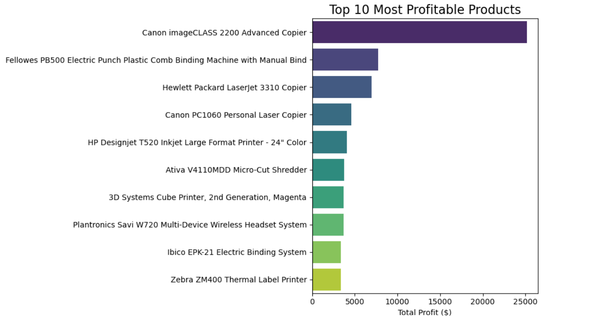
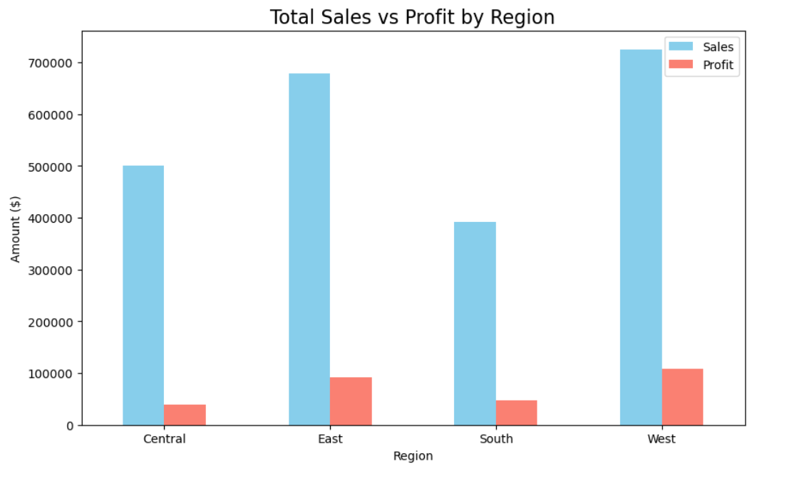

# Superstore Sales Profitability Analysis

**Python-based business intelligence project** | Identified +$250K in profit opportunities

### Business Objective
Analyze 4 years of U.S. superstore sales data to maximize profit.

### Key Insights & Recommendations
- Technology category = 51% of total profit → Expand inventory
- Central region loses money on high discounts → Cap at 20%
- Tables & Supplies sub-categories lose money → Phase out or renegotiate
- Top customers drive disproportionate profit → Create loyalty program

### Live Analysis
[Open notebook on GitHub →](https://github.com/waqarmemon10-netizen/superstore-sales-analysis/blob/main/Superstore_Analysis.ipynb)

[Run instantly in Google Colab (no install needed) →](https://colab.research.google.com/github/waqarmemon10-netizen/superstore-sales-analysis/blob/main/Superstore_Analysis.ipynb)
